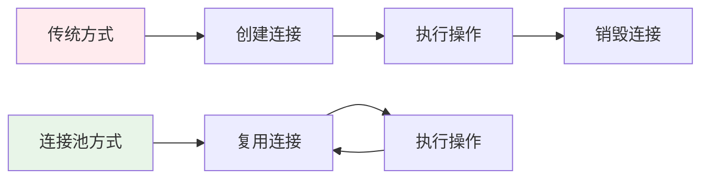

# 连接池完整解析

## 📋 目录
1. [设计思想](#设计思想)
2. [核心特性](#核心特性)
3. [与现有代码对比](#与现有代码对比)
4. [使用示例](#使用示例)
5. [高级用法](#高级用法)
6. [性能优势](#性能优势)
7. [实际应用](#实际应用)

---

## 🧠 设计思想

### 核心概念
连接池采用**模板化设计**和**工厂模式**，实现了一个通用的连接管理框架，可以适配任何类型的连接。

### 设计原则
1. **通用性**：一套代码适配多种连接类型
2. **类型安全**：编译时检查连接类型
3. **资源复用**：避免频繁创建/销毁连接
4. **异常安全**：RAII 资源管理
5. **线程安全**：支持多线程并发访问

---

## 🏗️ 核心特性

### 1. 模板化设计
```cpp
template<typename ConnectionType>
class ConnectionPool : public Singleton<ConnectionPool<ConnectionType>>
```

**优势：**
- **类型安全**：编译时检查连接类型
- **代码复用**：一套代码适配多种连接
- **灵活性**：支持任何自定义连接类型

### 2. 工厂模式
```cpp
using ConnectionFactory = std::function<ConnectionPtr()>;
void Initialize(size_t poolSize, ConnectionFactory factory);
```

**作用：**
- **解耦**：连接创建逻辑与池管理分离
- **可配置**：运行时决定如何创建连接
- **可扩展**：支持不同的连接创建策略

### 3. 核心操作
```cpp
ConnectionPtr GetConnection();        // 获取连接
void ReturnConnection(ConnectionPtr); // 归还连接
void Close();                         // 关闭池
size_t GetAvailableCount() const;     // 可用连接数
size_t GetInUseCount() const;         // 使用中连接数
```

---

## 🔄 与现有代码对比

### 1. MySQL 连接池对比

#### 你现有的实现
```cpp
class MySqlPool {
private:
    std::queue<std::unique_ptr<SqlConnection>> pool_;
    std::mutex mutex_;
    std::condition_variable cond_;
    std::atomic<bool> b_stop_;
    
public:
    std::unique_ptr<SqlConnection> getConnection() {
        std::unique_lock<std::mutex> lock(mutex_);
        cond_.wait(lock, [this] { 
            return b_stop_ || !pool_.empty(); 
        });
        if (b_stop_) return nullptr;
        
        auto con = std::move(pool_.front());
        pool_.pop();
        return con;
    }
};
```

#### 使用我的通用连接池
```cpp
// 定义 MySQL 连接类型
class MySQLConnection {
public:
    MySQLConnection(const std::string& url, const std::string& user, 
                   const std::string& pass, const std::string& schema);
    bool Execute(const std::string& sql);
    bool IsValid() const;
    void Close();
};

// 使用连接池
using MySQLPool = ConnectionPool<MySQLConnection>;

// 初始化
auto mysqlPool = MySQLPool::GetInstance();
mysqlPool.Initialize(10, []() {
    return std::make_shared<MySQLConnection>("localhost", "user", "pass", "db");
});

// 使用
auto conn = mysqlPool.GetConnection();
conn->Execute("SELECT * FROM users");
mysqlPool.ReturnConnection(conn);
```

### 2. Redis 连接池对比

#### 你现有的实现
```cpp
class RedisConPool {
private:
    std::queue<redisContext*> connections_;
    std::mutex mutex_;
    std::condition_variable cond_;
    
public:
    redisContext* getConnection() {
        std::unique_lock<std::mutex> lock(mutex_);
        cond_.wait(lock, [this] { 
            return b_stop_ || !connections_.empty(); 
        });
        if (b_stop_) return nullptr;
        
        auto context = connections_.front();
        connections_.pop();
        return context;
    }
};
```

#### 使用我的通用连接池
```cpp
// 定义 Redis 连接类型
class RedisConnection {
public:
    RedisConnection(const std::string& host, int port, const std::string& password);
    bool Execute(const std::string& command);
    bool IsValid() const;
    void Close();
};

// 使用连接池
using RedisPool = ConnectionPool<RedisConnection>;

// 初始化
auto redisPool = RedisPool::GetInstance();
redisPool.Initialize(5, []() {
    return std::make_shared<RedisConnection>("localhost", 6379, "password");
});

// 使用
auto conn = redisPool.GetConnection();
conn->Execute("SET key value");
redisPool.ReturnConnection(conn);
```

### 3. 对比总结

| 特性 | 现有实现 | 通用连接池 |
|------|----------|------------|
| 代码复用 | 每种连接类型需要单独实现 | 一套代码适配所有类型 |
| 类型安全 | 运行时检查 | 编译时检查 |
| 维护成本 | 高（多个相似类） | 低（统一管理） |
| 扩展性 | 差（硬编码） | 好（模板化） |
| 测试难度 | 高（需要测试多个类） | 低（测试一个模板类） |

---

## 📝 使用示例

### 1. MySQL 连接池

```cpp
// 定义 MySQL 连接类
class MySQLConnection {
public:
    MySQLConnection(const std::string& url, const std::string& user, 
                   const std::string& pass, const std::string& schema) {
        // 创建 MySQL 连接
        sql::mysql::MySQL_Driver* driver = sql::mysql::get_mysql_driver_instance();
        _connection = std::unique_ptr<sql::Connection>(driver->connect(url, user, pass));
        _connection->setSchema(schema);
        _isValid = true;
    }
    
    bool Execute(const std::string& sql) {
        if (!_isValid) return false;
        try {
            std::unique_ptr<sql::Statement> stmt(_connection->createStatement());
            stmt->execute(sql);
            return true;
        } catch (const sql::SQLException& e) {
            _isValid = false;
            return false;
        }
    }
    
    bool IsValid() const { return _isValid; }
    void Close() { _isValid = false; _connection.reset(); }
    
private:
    std::unique_ptr<sql::Connection> _connection;
    bool _isValid;
};

// 使用连接池
void MySQLExample() {
    auto& mysqlPool = ConnectionPool<MySQLConnection>::GetInstance();
    
    // 初始化
    mysqlPool.Initialize(5, []() {
        return std::make_shared<MySQLConnection>("localhost:3306", "user", "pass", "mydb");
    });
    
    // 使用连接
    auto conn = mysqlPool.GetConnection();
    if (conn) {
        conn->Execute("SELECT * FROM users LIMIT 10");
        mysqlPool.ReturnConnection(conn);
    }
}
```

### 2. Redis 连接池

```cpp
// 定义 Redis 连接类
class RedisConnection {
public:
    RedisConnection(const std::string& host, int port, const std::string& password) {
        _context = redisConnect(host.c_str(), port);
        if (_context && _context->err == 0) {
            if (!password.empty()) {
                auto reply = (redisReply*)redisCommand(_context, "AUTH %s", password.c_str());
                if (reply->type == REDIS_REPLY_ERROR) {
                    freeReplyObject(reply);
                    throw std::runtime_error("Redis authentication failed");
                }
                freeReplyObject(reply);
            }
            _isValid = true;
        }
    }
    
    bool Execute(const std::string& command) {
        if (!_isValid) return false;
        try {
            auto reply = (redisReply*)redisCommand(_context, command.c_str());
            if (reply) {
                freeReplyObject(reply);
                return true;
            }
            return false;
        } catch (...) {
            _isValid = false;
            return false;
        }
    }
    
    bool IsValid() const { return _isValid; }
    void Close() { 
        if (_context) {
            redisFree(_context);
            _context = nullptr;
        }
        _isValid = false;
    }
    
private:
    redisContext* _context;
    bool _isValid;
};

// 使用连接池
void RedisExample() {
    auto& redisPool = ConnectionPool<RedisConnection>::GetInstance();
    
    // 初始化
    redisPool.Initialize(3, []() {
        return std::make_shared<RedisConnection>("localhost", 6379, "password");
    });
    
    // 使用连接
    auto conn = redisPool.GetConnection();
    if (conn) {
        conn->Execute("SET key value");
        redisPool.ReturnConnection(conn);
    }
}
```

### 3. HTTP 连接池

```cpp
// 定义 HTTP 连接类
class HttpConnection {
public:
    HttpConnection(const std::string& host, int port) {
        // 使用 Boost.Beast 或其他 HTTP 客户端库
        _isValid = true;
    }
    
    bool Execute(const std::string& request) {
        if (!_isValid) return false;
        // 发送 HTTP 请求
        return true;
    }
    
    bool IsValid() const { return _isValid; }
    void Close() { _isValid = false; }
    
private:
    bool _isValid;
};

// 使用连接池
void HttpExample() {
    auto& httpPool = ConnectionPool<HttpConnection>::GetInstance();
    
    // 初始化
    httpPool.Initialize(4, []() {
        return std::make_shared<HttpConnection>("api.example.com", 80);
    });
    
    // 使用连接
    auto conn = httpPool.GetConnection();
    if (conn) {
        conn->Execute("GET /api/data HTTP/1.1");
        httpPool.ReturnConnection(conn);
    }
}
```

---

## 🚀 高级用法

### 1. 多数据库管理器

```cpp
class DatabaseManager {
private:
    ConnectionPool<MySQLConnection> _mysqlPool;
    ConnectionPool<RedisConnection> _redisPool;
    ConnectionPool<HttpConnection> _httpPool;
    
public:
    DatabaseManager() {
        // 初始化 MySQL 连接池
        _mysqlPool.Initialize(5, []() {
            return std::make_shared<MySQLConnection>("localhost:3306", "user", "pass", "db");
        });
        
        // 初始化 Redis 连接池
        _redisPool.Initialize(3, []() {
            return std::make_shared<RedisConnection>("localhost", 6379, "pass");
        });
        
        // 初始化 HTTP 连接池
        _httpPool.Initialize(4, []() {
            return std::make_shared<HttpConnection>("api.example.com", 80);
        });
    }
    
    // 事务操作示例
    bool ProcessUserRegistration(const std::string& username, const std::string& email) {
        // 获取 MySQL 连接
        auto mysqlConn = _mysqlPool.GetConnection();
        if (!mysqlConn) return false;
        
        // 获取 Redis 连接
        auto redisConn = _redisPool.GetConnection();
        if (!redisConn) {
            _mysqlPool.ReturnConnection(mysqlConn);
            return false;
        }
        
        try {
            // 在 MySQL 中插入用户
            mysqlConn->Execute("INSERT INTO users (username, email) VALUES ('" + username + "', '" + email + "')");
            
            // 在 Redis 中缓存用户信息
            redisConn->Execute("SET user:" + username + " " + email);
            
            // 归还连接
            _mysqlPool.ReturnConnection(mysqlConn);
            _redisPool.ReturnConnection(redisConn);
            
            return true;
        } catch (...) {
            // 归还连接
            _mysqlPool.ReturnConnection(mysqlConn);
            _redisPool.ReturnConnection(redisConn);
            return false;
        }
    }
    
    void Close() {
        _mysqlPool.Close();
        _redisPool.Close();
        _httpPool.Close();
    }
};
```

### 2. 连接健康检查

```cpp
template<typename ConnectionType>
class HealthCheckableConnection : public ConnectionType {
public:
    template<typename... Args>
    HealthCheckableConnection(Args&&... args) 
        : ConnectionType(std::forward<Args>(args)...) {}
    
    virtual bool Ping() = 0;
};

class MySQLConnectionWithHealthCheck : public HealthCheckableConnection<MySQLConnection> {
public:
    MySQLConnectionWithHealthCheck(const std::string& url, const std::string& user, 
                                  const std::string& pass, const std::string& schema)
        : HealthCheckableConnection(url, user, pass, schema) {}
    
    bool Ping() override {
        return Execute("SELECT 1");
    }
};

// 使用带健康检查的连接池
void HealthCheckExample() {
    auto& mysqlPool = ConnectionPool<MySQLConnectionWithHealthCheck>::GetInstance();
    
    mysqlPool.Initialize(5, []() {
        return std::make_shared<MySQLConnectionWithHealthCheck>("localhost", "user", "pass", "db");
    });
    
    // 定期健康检查
    auto conn = mysqlPool.GetConnection();
    if (conn && conn->Ping()) {
        // 连接健康，可以使用
        conn->Execute("SELECT * FROM users");
        mysqlPool.ReturnConnection(conn);
    } else {
        // 连接不健康，丢弃
        LOG_WARNING("Unhealthy connection detected");
    }
}
```

### 3. 连接池监控

```cpp
template<typename ConnectionType>
class MonitoredConnectionPool : public ConnectionPool<ConnectionType> {
public:
    struct PoolStats {
        size_t totalConnections;
        size_t availableConnections;
        size_t inUseConnections;
        size_t failedConnections;
        double averageWaitTime;
    };
    
    PoolStats GetStats() const {
        PoolStats stats;
        stats.totalConnections = this->GetPoolSize();
        stats.availableConnections = this->GetAvailableCount();
        stats.inUseConnections = this->GetInUseCount();
        // 其他统计信息...
        return stats;
    }
    
    void LogStats() {
        auto stats = GetStats();
        LOG_INFO("Pool Stats - Total: {}, Available: {}, InUse: {}, Failed: {}", 
                 stats.totalConnections, stats.availableConnections, 
                 stats.inUseConnections, stats.failedConnections);
    }
};
```

---

## ⚡ 性能优势

### 1. 连接复用 vs 传统方式



### 2. 性能对比

| 指标 | 传统方式 | 连接池方式 |
|------|----------|------------|
| 连接创建开销 | 高 | 低 |
| 内存使用 | 高 | 低 |
| 响应时间 | 慢 | 快 |
| 并发能力 | 低 | 高 |
| 资源管理 | 复杂 | 简单 |

### 3. 适用场景

- **高并发系统**：减少连接创建开销
- **数据库应用**：提高查询性能
- **微服务架构**：管理服务间连接
- **实时系统**：减少延迟

---

## 🎯 实际应用

### 1. 在你的项目中的应用

#### 替换现有的 MySQL 连接池
```cpp
// 替换 MySqlPool
class MysqlDao {
private:
    ConnectionPool<MySQLConnection> _pool;
    
public:
    MysqlDao() {
        _pool.Initialize(10, []() {
            return std::make_shared<MySQLConnection>("localhost", "user", "pass", "schema");
        });
    }
    
    int RegUser(const std::string& name, const std::string& email, const std::string& pwd) {
        auto conn = _pool.GetConnection();
        if (!conn) return -1;
        
        try {
            conn->Execute("INSERT INTO users (name, email, pwd) VALUES ('" + name + "', '" + email + "', '" + pwd + "')");
            _pool.ReturnConnection(conn);
            return 0;
        } catch (...) {
            _pool.ReturnConnection(conn);
            return -1;
        }
    }
};
```

#### 替换现有的 Redis 连接池
```cpp
// 替换 RedisConPool
class RedisMgr : public Singleton<RedisMgr> {
private:
    ConnectionPool<RedisConnection> _pool;
    
public:
    bool Get(const std::string& key, std::string& value) {
        auto conn = _pool.GetConnection();
        if (!conn) return false;
        
        try {
            conn->Execute("GET " + key);
            _pool.ReturnConnection(conn);
            return true;
        } catch (...) {
            _pool.ReturnConnection(conn);
            return false;
        }
    }
};
```

### 2. 网关服务器中的应用

```cpp
class GateServer {
private:
    ConnectionPool<HttpConnection> _httpPool;
    ConnectionPool<gRPCConnection> _grpcPool;
    
public:
    void HandleRequest(const HttpRequest& req) {
        // 处理 HTTP 请求
        auto httpConn = _httpPool.GetConnection();
        if (httpConn) {
            httpConn->Execute(req.ToString());
            _httpPool.ReturnConnection(httpConn);
        }
        
        // 调用其他服务
        auto grpcConn = _grpcPool.GetConnection();
        if (grpcConn) {
            grpcConn->Execute(req.ToGRPCRequest());
            _grpcPool.ReturnConnection(grpcConn);
        }
    }
};
```

### 3. 聊天服务器中的应用

```cpp
class ChatServer {
private:
    ConnectionPool<MySQLConnection> _mysqlPool;
    ConnectionPool<RedisConnection> _redisPool;
    
public:
    void ProcessMessage(const ChatMessage& msg) {
        // 存储消息到 MySQL
        auto mysqlConn = _mysqlPool.GetConnection();
        if (mysqlConn) {
            mysqlConn->Execute("INSERT INTO messages (user_id, content, timestamp) VALUES (" + 
                              std::to_string(msg.userId) + ", '" + msg.content + "', NOW())");
            _mysqlPool.ReturnConnection(mysqlConn);
        }
        
        // 缓存用户状态到 Redis
        auto redisConn = _redisPool.GetConnection();
        if (redisConn) {
            redisConn->Execute("SET user:" + std::to_string(msg.userId) + ":last_active " + 
                              std::to_string(std::time(nullptr)));
            _redisPool.ReturnConnection(redisConn);
        }
    }
};
```

---

## 🏆 总结

### 核心优势
1. **通用性**：一套代码适配多种连接类型
2. **类型安全**：编译时检查，避免运行时错误
3. **高性能**：连接复用，减少创建开销
4. **易维护**：统一的管理接口
5. **可扩展**：支持自定义连接类型

### 设计亮点
1. **模板化设计**：类型安全的通用实现
2. **工厂模式**：灵活的连接创建策略
3. **RAII 管理**：自动资源管理
4. **线程安全**：支持多线程并发
5. **异常安全**：强异常安全保证

### 应用价值
- **简化代码**：减少重复的连接池实现
- **提高性能**：连接复用和资源管理
- **增强可靠性**：统一的错误处理和资源管理
- **便于测试**：统一的接口便于单元测试
- **易于扩展**：支持新的连接类型

这个通用连接池设计不仅解决了你现有代码中的重复问题，还为未来的扩展提供了良好的基础。它展示了现代C++模板编程和设计模式的强大能力！🚀 